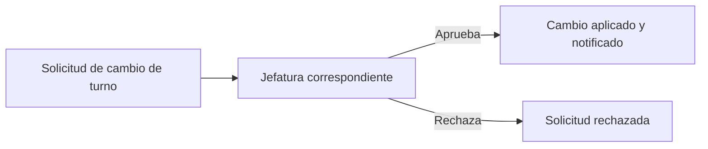
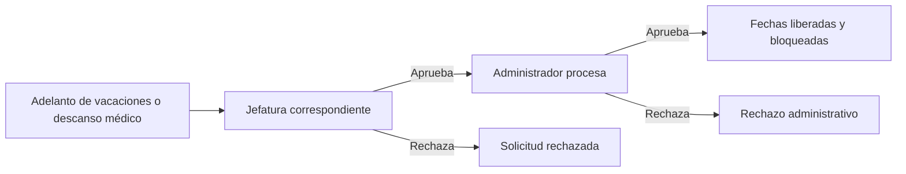

# TurnioMed

Sistema web académico para gestionar turnos, vacaciones y solicitudes del
personal asistencial de una institución hospitalaria. La versión actual se
implementa en Django y se divide en dos módulos web:

- `AdminPanel`: operaciones del Administrador funcional o Jefe de Personal.
- `TurnosMed`: operación de Jefes de Departamento y Jefes de Área.

## Descripción del Sistema

### Estado actual

La plataforma web cuenta con:

- autenticación mediante el modelo personalizado `TurnosMed.Usuario`
- administración de personal, vacaciones anuales y solicitudes finales
- programación mensual de turnos para jefaturas
- consulta anual de vacaciones con resaltado global y por trabajador
- bandejas de solicitudes por ámbito de responsabilidad
- reportes de cambios, vacaciones y descansos médicos con exportación PDF
- notificaciones internas creadas al resolver solicitudes
- restricciones automáticas de programación ya definidas por negocio

La aplicación móvil no forma parte de esta primera versión. Mientras se
desarrolla, las solicitudes de prueba pueden registrarse desde Django Admin

### Tecnología y estructura

| Componente | Implementación actual |
| --- | --- |
| Backend | Python y Django |
| Interfaz | Django Templates, HTML, CSS y JavaScript |
| Persistencia de desarrollo | SQLite |
| Idioma y zona horaria | Español, `America/Lima` |
| Autenticación | `TurnosMed.Usuario` |
| Aplicación móvil | Proyectada para una fase futura |

```text
TF-TurnioMed/
|-- AdminPanel/          # Panel del Jefe de Personal
|-- TurnosMed/           # Modelos y módulo operativo de jefaturas
|-- config/              # Configuración y rutas del proyecto Django
|-- manage.py
`-- db.sqlite3           # Base local de desarrollo
```

### Usuarios y accesos

#### Superusuario Django

Es una cuenta técnica con `is_superuser=True`. Accede a `/admin/` para
mantenimiento, carga inicial y preparación de datos de prueba. No representa
al Jefe de Personal y no aparece como personal institucional en `AdminPanel`.

#### Administrador o Jefe de Personal

Es el rol funcional `rol='admin'` y accede a `/panel/`. Sus vistas permiten:

- consultar indicadores de personal, vacaciones y solicitudes
- agregar, editar y desactivar personal sin eliminar su historial
- registrar, modificar y eliminar vacaciones anuales
- procesar adelantos de vacaciones y descansos médicos que la jefatura haya aprobado
- generar notificaciones internas al procesar solicitudes

Al agregar personal desde `AdminPanel`:

- la contraseña inicial es el DNI
- `Área` y `Sala` se filtran según la selección organizacional previa
- no se captura un campo manual de cargo: la etiqueta visible se deriva del
  rol, el tipo de trabajador y la ubicación asignada.

#### Jefe de Departamento

Accede al módulo `TurnosMed`. Visualiza y programa a los Jefes de Área de su
departamento, filtra por área, consulta vacaciones y revisa las solicitudes
que corresponden a dichos jefes.

#### Jefe de Área

Accede al módulo `TurnosMed`. Visualiza y programa al personal asistencial de
las salas de su área, filtra por sala, consulta vacaciones, revisa solicitudes
y obtiene reportes dentro de su ámbito.

#### Personal asistencial

Representa a licenciadas de enfermería, técnicos de enfermería o médicos
asignados a una sala. La consulta personal de turnos, el envío de solicitudes
y la recepción de notificaciones se proyectan principalmente para la
aplicación móvil.

### Organización institucional

```text
Departamento
  -> Área
      -> Sala
          -> Personal asistencial
```

| Entidad | Uso |
| --- | --- |
| `Departamento` | Unidad superior, de tipo enfermería o medicina |
| `Área` | División dependiente de un departamento |
| `Sala` | Ubicación de trabajo dentro de un área |
| `Usuario` | Cuenta con rol, tipo de trabajador, condición y ubicación |

Un departamento de enfermería solo admite licenciadas y técnicos de
enfermería; un departamento médico admite personal médico.

### Módulo AdminPanel

| Vista | Función |
| --- | --- |
| Inicio | Indicadores y actividad administrativa reciente |
| Personal | Listado, filtros, alta, edición y desactivación lógica |
| Vacaciones | Programación anual administrada por el Jefe de Personal |
| Solicitudes | Procesamiento final de adelantos y descansos médicos |

El inicio administrativo no muestra un título redundante de dashboard. El
sidebar y el topbar mantienen dimensiones comunes con las demás vistas.

### Módulo TurnosMed

| Vista | Función |
| --- | --- |
| Inicio | Resumen de turnos, horas y solicitudes visibles |
| Turnos | Edición mensual por teclado y selección múltiple |
| Solicitudes | Revisión inicial según jerarquía |
| Vacaciones | Consulta anual, no edición |
| Reportes | Consulta por periodo y descarga PDF |

En la vista de vacaciones, todos los periodos visibles aparecen marcados por
defecto y, al seleccionar personal, sus días se resaltan con mayor énfasis.
Los campos de periodo y observaciones son informativos, no editables.

### Rutas principales

| Ruta | Acceso | Uso |
| --- | --- | --- |
| `/signin/` | Usuarios habilitados | Inicio de sesión |
| `/admin/` | Superusuario | Administración nativa Django |
| `/panel/` | Administrador funcional | Inicio de AdminPanel |
| `/panel/personal/` | Administrador funcional | Personal |
| `/panel/vacaciones/` | Administrador funcional | Vacaciones anuales |
| `/panel/solicitudes/` | Administrador funcional | Procesamiento final |
| `/home/` | Jefaturas | Inicio operativo |
| `/turnos/` | Jefaturas | Programación de turnos |
| `/solicitudes/` | Jefaturas | Revisión inicial |
| `/vacaciones/` | Jefaturas | Consulta anual |
| `/reportes/` | Jefaturas | Reportes y PDF |

### Datos y modelos principales

| Modelo | Responsabilidad |
| --- | --- |
| `Departamento`, `Area`, `Sala` | Estructura organizacional |
| `Usuario` | Cuenta, rol, tipo laboral y ubicación |
| `Turno` | Asignación diaria de código de turno |
| `ProgramacionVacaciones` | Periodo anual registrado por administración |
| `SolicitudCambioTurno` | Intercambio revisado por jefatura |
| `SolicitudVacaciones` | Adelanto con procesamiento administrativo |
| `SolicitudDescansoMedico` | Descanso con procesamiento administrativo |
| `Notificacion` | Aviso interno del sistema |

### Ejecución local y pruebas

```powershell
python -m pip install Django
python manage.py migrate
python manage.py createsuperuser
python manage.py runserver
```

Para verificar el proyecto:

```powershell
python manage.py check
python manage.py test AdminPanel TurnosMed
```

Datos mínimos recomendados para pruebas manuales:

1. Un departamento, un área y una sala.
2. Un Administrador funcional no superusuario.
3. Un Jefe de Área nombrado.
4. Personal asistencial de la misma área y sala.
5. Una programación anual de vacaciones.
6. Solicitudes creadas en Django Admin mientras no exista la app móvil.

### Proyección futura

La evolución prevista contempla:

- aplicación móvil para el personal y el envío de solicitudes
- API para comunicar la app móvil con el backend
- notificaciones más completas y auditoría ampliada
- exportación Excel e importación de programación
- posibles reglas institucionales configurables cuando exista un criterio cerrado

## Lógica de Negocio

### Roles y jerarquía

- Puede existir más de un Jefe de Área dentro de una misma área.
- Solo puede existir un Jefe de Departamento por departamento.
- Un Jefe de Departamento se asigna a departamento, no a área o sala.
- Un Jefe de Área se asigna a departamento y área, no a sala.
- Un jefe debe ser nombrado y no puede ser técnico de enfermería.
- El personal asistencial requiere departamento, área y sala coherentes.

### Alcance de programación

- El Jefe de Departamento ve y programa turnos de los Jefes de Área de su departamento.
- El Jefe de Área ve y programa turnos del personal asistencial de su área.
- El Administrador y el Jefe de Departamento no reciben turnos en la programación actual.
- La programación de turnos propios de Jefes de Departamento por el Jefe de Personal queda fuera del alcance actual.

### Códigos de turno

| Código | Denominación | Horario | Horas |
| --- | --- | --- | ---: |
| `D4` | Día completo | 07:00 - 19:30 | 12.5 |
| `N4` | Noche completa | 19:00 - 07:30 | 12.5 |
| `D` | Día | 07:00 - 19:00 | 12 |
| `N` | Noche | 19:00 - 07:00 | 12 |
| `M` | Medio día | 07:00 - 13:00 | 6 |
| `T` | Tarde | 13:00 - 19:00 | 6 |

### Restricciones de turnos

No se permite programar turnos para un trabajador:

- el día de su cumpleaños
- durante sus vacaciones anuales programadas
- durante un adelanto de vacaciones procesado favorablemente
- durante un descanso médico procesado favorablemente

Cuando se registra o aprueba un periodo que bloquea fechas, los turnos
existentes dentro del intervalo se eliminan y esas fechas quedan impedidas
para nuevas asignaciones.

Por ahora no se aplican automáticamente reglas de horas máximas, descansos
obligatorios, cobertura mínima por sala, feriados, reemplazos o asignación
según condición laboral, pues dependen del criterio de cada jefatura.

### Vacaciones anuales y adelantos

La programación anual se registra desde `AdminPanel` y es consultable por la
jefatura correspondiente en `TurnosMed`.

Un adelanto de vacaciones:

- requiere una programación anual pendiente del mismo año
- debe ocurrir antes del periodo anual pendiente
- no puede exceder los días disponibles
- descuenta sus días del periodo anual original
- elimina turnos existentes en el periodo adelantado
- elimina la programación restante si consume todos los días disponibles

Ejemplo:

```text
Programación original: 01/06/2026 al 30/06/2026
Adelanto aprobado:     01/05/2026 al 15/05/2026
Saldo programado:      16/06/2026 al 30/06/2026
```

### Descanso médico

El descanso médico aprobado por la jefatura pasa al Administrador para su
procesamiento. Si se aprueba:

- se eliminan los turnos comprendidos en sus fechas
- se bloquean nuevas asignaciones durante el descanso
- puede representar un descanso en curso sin fecha final

### Cambios de turno

El cambio de turno se resuelve directamente por el jefe correspondiente y no
pasa por el Administrador.

Para aceptar un intercambio:

- los trabajadores deben pertenecer al mismo departamento y área
- deben tener la misma condición laboral: `CAS` con `CAS`, `Nombrado` con
  `Nombrado` o `Tercero` con `Tercero`
- ambos turnos deben existir
- ambos turnos deben tener la misma cantidad de horas
- en una misma fecha no pueden intercambiar el mismo código

Compatibilidad por duración:

| Horas | Compatibilidad |
| ---: | --- |
| 12.5 | `D4` con `N4`, o mismo código en fechas distintas |
| 12 | `D` con `N`, o mismo código en fechas distintas |
| 6 | `M` con `T`, o mismo código en fechas distintas |

Así, en una misma fecha se permite `D` por `N` o `M` por `T`, pero no `D` por
`D`. Al aprobarse el cambio, se intercambian los códigos, se mantiene el
historial de solicitud y se crean notificaciones internas.

### Flujo de solicitudes

Revisión inicial:

| Solicitante | Revisor |
| --- | --- |
| Personal asistencial | Jefe de Área de su área |
| Jefe de Área | Jefe de Departamento de su departamento |

Flujos:





| Estado | Significado |
| --- | --- |
| `pendiente` | Espera revisión de la jefatura |
| `aprobado_jefe` | Espera procesamiento administrativo |
| `rechazado_jefe` | Finalizado por rechazo de jefatura |
| `procesado` | Finalizado favorablemente |
| `rechazado_admin` | Finalizado por rechazo administrativo |

En solicitudes de cambio, una aprobación de jefatura pasa directamente al
estado `procesado`.
